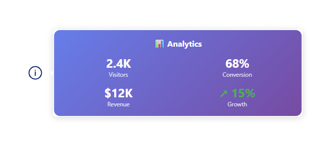
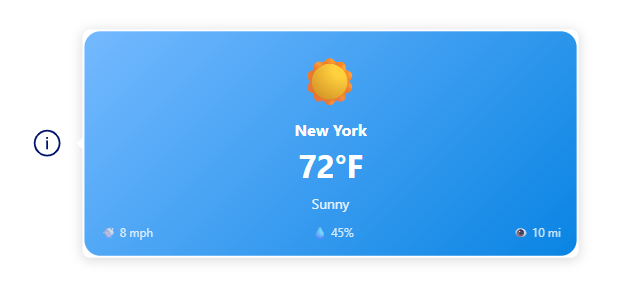
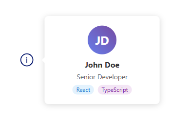
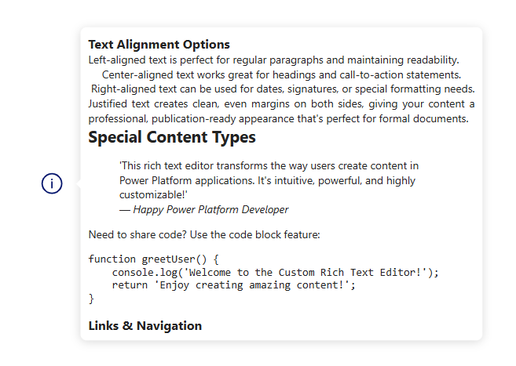

# PowerApps PCF Customisable HTML Tooltip Component

[](./LICENSE)

A highly customizable PowerApps Component Framework (PCF) control that provides rich HTML tooltip functionality with extensive styling and animation options.

 
 
 

## 🚀 Features

- **Rich HTML Content**: Display formatted HTML content in tooltips with automatic sanitization
- **Smart Positioning**: Intelligent tooltip placement using Floating UI with automatic repositioning
- **Responsive Design**: Automatically adjusts to component resizing in PowerApps
- **Extensive Customization**: 20+ configurable properties for complete control over appearance and behavior
- **Smooth Animations**: Multiple animation types with customizable timing and directions
- **Accessibility**: Built with modern React and follows accessibility best practices

## 📦 Installation

1. Download the latest release from the releases section
2. Import the solution into your PowerApps environment
3. Add the component to your canvas app or model-driven form

## 🎯 Use Cases

- **Help Text**: Provide contextual help information for form fields
- **Rich Descriptions**: Display formatted descriptions with HTML content
- **Interactive Guides**: Create guided experiences with styled tooltips
- **Data Visualization**: Show additional details for charts and reports
- **User Onboarding**: Create informative tooltips for new user experiences

## ⚙️ Properties

### Core Properties

| Property | Type | Required | Description |
|----------|------|----------|-------------|
| **Tooltip Content** | Text Area | ✅ | HTML content to display in the tooltip |
| **Placement** | Text | ✅ | Tooltip position: `top`, `bottom`, `left`, `right` |
| **Is Visible** | Yes/No | ✅ | Control tooltip visibility |

### Container Styling

| Property | Type | Default | Description |
|----------|------|---------|-------------|
| **Container Background Color** | Text | - | Background color of the container (CSS color) |

### Tooltip Dimensions

| Property | Type | Default | Description |
|----------|------|---------|-------------|
| **Tooltip Width** | Number | 320px | Width of the tooltip in pixels |
| **Tooltip Height** | Number | Auto | Height of the tooltip in pixels |
| **Content Height Auto Resizable** | Yes/No | `true` | Auto-resize height to content or use fixed height |

### Arrow Customization

| Property | Type | Default | Description |
|----------|------|---------|-------------|
| **Arrow Size** | Number | 8px | Size of the tooltip arrow in pixels |
| **Arrow Color** | Text | `#fff` | Color of the tooltip arrow (CSS color) |
| **Tooltip Offset** | Number | 8px | Gap between tooltip and container in pixels |

### Border Styling

| Property | Type | Default | Description |
|----------|------|---------|-------------|
| **Border Width** | Number | - | Width of the tooltip border in pixels |
| **Border Color** | Text | - | Color of the tooltip border (CSS color) |
| **Border Style** | Text | - | Style of the border (`solid`, `dashed`, `dotted`, etc.) |
| **Border Radius** | Number | 8px | Border radius of the tooltip in pixels |

### Shadow Effects

| Property | Type | Default | Description |
|----------|------|---------|-------------|
| **Shadow Offset X** | Number | 0px | Horizontal shadow offset in pixels |
| **Shadow Offset Y** | Number | 2px | Vertical shadow offset in pixels |
| **Shadow Blur** | Number | 12px | Shadow blur radius in pixels |
| **Shadow Spread** | Number | 0px | Shadow spread radius in pixels |
| **Shadow Color** | Text | `rgba(0,0,0,0.15)` | Shadow color (CSS color) |

### Animation Controls

| Property | Type | Default | Description |
|----------|------|---------|-------------|
| **Transition Duration** | Number | 200ms | Duration of show/hide transitions |
| **Animation Type** | Text | `fade` | Animation type: `fade`, `scale`, `slide` |
| **Animation Direction** | Text | `up` | Direction for slide animations: `up`, `down`, `left`, `right` |
| **Hover Delay** | Number | 0ms | Delay before showing tooltip on hover |
| **Hide Delay** | Number | 100ms | Delay before hiding tooltip after mouse leave |

### Padding Controls

| Property | Type | Default | Description |
|----------|------|---------|-------------|
| **Padding Top** | Number | 12px | Top padding inside the tooltip |
| **Padding Right** | Number | 12px | Right padding inside the tooltip |
| **Padding Bottom** | Number | 12px | Bottom padding inside the tooltip |
| **Padding Left** | Number | 12px | Left padding inside the tooltip |

## 🎨 Styling Examples

### Basic HTML Tooltip
```html
<b>Important Information</b><br/>
<i>This field is required for processing.</i>
```

### Rich Content with Styling
```html
<div style="color: #e74c3c;">
  <h3 style="margin: 0; color: #2c3e50;">⚠️ Warning</h3>
  <p style="margin: 5px 0;">Please review the following:</p>
  <ul style="margin: 5px 0; padding-left: 20px;">
    <li>Verify all required fields</li>
    <li>Check data accuracy</li>
    <li>Confirm before submitting</li>
  </ul>
</div>
```

### Data Display
```html
<table style="border-collapse: collapse; width: 100%;">
  <tr>
    <td style="padding: 4px; border: 1px solid #ddd;"><b>Status:</b></td>
    <td style="padding: 4px; border: 1px solid #ddd; color: green;">✅ Active</td>
  </tr>
  <tr>
    <td style="padding: 4px; border: 1px solid #ddd;"><b>Last Updated:</b></td>
    <td style="padding: 4px; border: 1px solid #ddd;">2024-08-26</td>
  </tr>
</table>
```

## 🔧 Configuration Examples

### Subtle Information Tooltip
- **Animation Type**: `fade`
- **Transition Duration**: `150ms`
- **Border Radius**: `4px`
- **Shadow Blur**: `8px`
- **Padding**: `8px` (all sides)

### Attention-Grabbing Warning
- **Animation Type**: `scale`
- **Transition Duration**: `300ms`
- **Border Width**: `2px`
- **Border Color**: `#e74c3c`
- **Shadow Color**: `rgba(231, 76, 60, 0.3)`

### Slide-in Help Text
- **Animation Type**: `slide`
- **Animation Direction**: `up`
- **Transition Duration**: `250ms`
- **Hover Delay**: `500ms`

## 🛠️ Technical Details

### Built With
- **React 18+**: Modern React with hooks and functional components
- **TypeScript**: Full type safety and IntelliSense support
- **Floating UI**: Advanced positioning and collision detection
- **PowerApps Component Framework**: Native PCF integration

### Browser Support
- Chrome 90+
- Firefox 88+
- Safari 14+
- Edge 90+

### Security
- Automatic HTML sanitization to prevent XSS attacks
- Script and style tag removal
- Event handler attribute stripping
- Safe inline styling with reset for common elements

## 📱 Responsive Behavior

The component automatically:
- Adjusts to PowerApps component resizing
- Repositions tooltips to stay within viewport
- Handles container size changes gracefully
- Maintains aspect ratios across different screen sizes

## 🐛 Troubleshooting

### Common Issues

**Tooltip not showing:**
- Verify `Is Visible` property is set to `Yes`
- Check that `Tooltip Content` is not empty
- Ensure the component has sufficient space

**Positioning issues:**
- Adjust `Tooltip Offset` to create more space
- Try different `Placement` values
- Check for container overflow settings

**Styling not applied:**
- Verify HTML syntax in `Tooltip Content`
- Check CSS color values are valid
- Ensure border properties are complete

---

## 📜 License

This project is licensed under the **MIT License** – see the [LICENSE](./LICENSE) file for details.  

